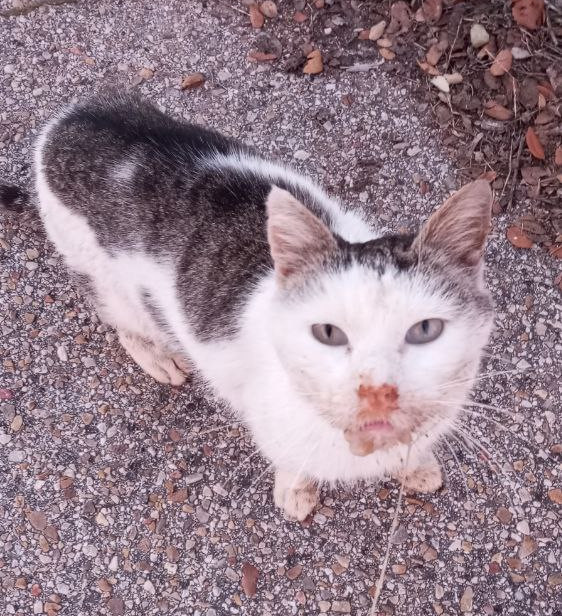

import { Link } from 'gatsby';

import { CallToAction } from '../../../src/components';

En lo más profundo del antiguo supermercado del Encinar, un pequeño ser peludo
luchaba por su vida. Adolfo, un dulce gatito, se encontraba al borde del
abismo, enfermo y débil, con un gripazo que le impedía hasta siquiera
alimentarse. Sus ojos vidriosos reflejaban el sufrimiento de alguien que había
perdido la esperanza.

Pero en medio de la oscuridad y el abandono, surgió una luz de esperanza. Los
voluntarios del CER El Encinar, con corazones llenos de compasión
y amor por los animales, decidieron no rendirse ante la adversidad. Con cuidado
y dedicación, tomaron a Adolfo bajo su protección, prometiendo no dejarlo solo
en su lucha.

Con cada dosis de antibióticos, Adolfo comenzó a recuperar fuerzas. Las manos
amorosas de los voluntarios le brindaban el calor y la ternura que tanto
necesitaba. Con cada caricia y palabra de aliento, el pequeño gatito encontraba
la fuerza para seguir adelante.

Los días pasaron, y poco a poco, Adolfo comenzó a mostrar signos de mejoría. Su
pelaje, una vez opaco y desaliñado, ahora brillaba con vitalidad. Sus ojos,
antes apagados, ahora destellaban con una chispa renovada de vida. Ya no había
rastro del gatito moribundo que yacía en las sombras del supermercado. En su
lugar, se alzaba un guerrero valiente, listo para enfrentar cualquier desafío
que la vida le presentara.

La historia de Adolfo es un testimonio de fortaleza y resiliencia, un
recordatorio de que incluso en los momentos más oscuros, siempre hay una luz de
esperanza que brilla en el horizonte. Gracias al amor incondicional y el
cuidado de los voluntarios del CER El Encinar, Adolfo encontró
una segunda oportunidad en la vida. Y ahora, con cada paso que da hacia la
recuperación, inspira a todos aquellos que tienen el privilegio de conocer su
historia.

Que la historia de Adolfo sea un recordatorio de que, con amor, dedicación y
apoyo mutuo, podemos superar cualquier obstáculo que se interponga en nuestro
camino. Porque al final del día, lo que realmente importa no es la adversidad
que enfrentamos, sino cómo elegimos responder ante ella. Y Adolfo, con su
valentía y determinación, nos recuerda que siempre hay esperanza, incluso en
los momentos más oscuros.

<CallToAction>
  <Link to="/colabora/">
    Ayuda a Adolfo y a otros gatos como él apoyando el proyecto del CER El
    Encinar
  </Link>
</CallToAction>
